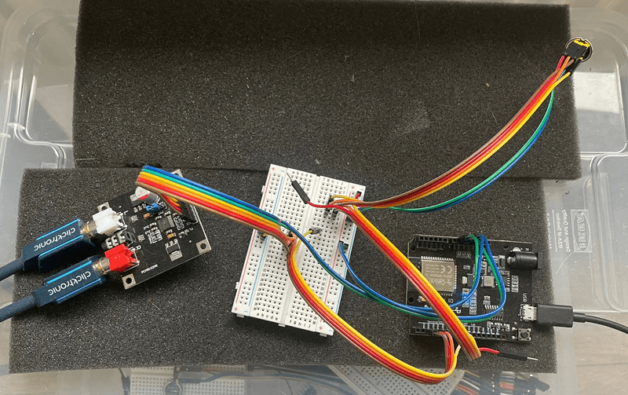

A2DP-SINK & HFP CLIENT
======================

This is a working version of API implementing both Advanced Audio Distribution Profile and HFP Client.

This involves the use of Bluetooth legacy profile A2DP for audio stream reception, AVRCP for media information notifications, HFP client for making/answering phone calls and I2S for audio stream input/output interface.
Or in normal words: you turn your esp32 in both a carkit and a bluetooth speaker.

## How to use

### Hardware Required

Besides a ESP32 you'll need a I2S DAC (I used a PCM5102) and a mems microphone (I used a INMP441)

GPIO pins for our i2s DAC are set in main.c, and can be changed to whatever you like
```
bt_i2s_set_tx_I2S_pins(GPIO_NUM_26, GPIO_NUM_17, GPIO_NUM_25, GPIO_NUM_NC);
```
Same goes for our i2s mems microphone pins
```
bt_i2s_set_rx_I2S_pins(GPIO_NUM_16, GPIO_NUM_27, GPIO_NUM_NC, GPIO_NUM_14);
```


### Build and Flash

Assuming you're using ESP-IDF5.1 you should be able to build and flash straight away. `sdkconfig.defaults` enables bluedroid, hfp, adp and other necessities.

## Usage

After the program is started, smart phones can discover and connect to a device named "ESP_SPEAKER".
You should be able to stream music from your phone now; and make/recieve phone calls.

## Notes
* A2DP is default 44.1kHz 16-bit stereo
* HFP client (only) supports msbc codec (highest quality)
* BT pin code and I2S GPIO pins are set in main.c
* codebase is quite messy right now; I'll be focussing on cleaning up - and converting to a ESP-IDF component

## Issues
I'm not your helpdesk.
Everything is here: https://docs.espressif.com/projects/esp-idf/en/latest/esp32/get-started/

## Pull requests
More than welcome.

## todo
* move codec from i2s to hfp
* pull codec init out of funtions. init every 7.5 us is too expensive
* fix i2s write semaphore(s)
* start / stop hfp as a (none blocking) task
* move to component
* 

