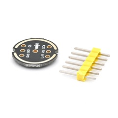
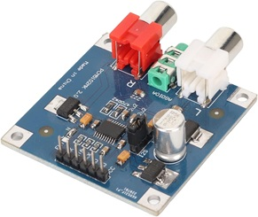
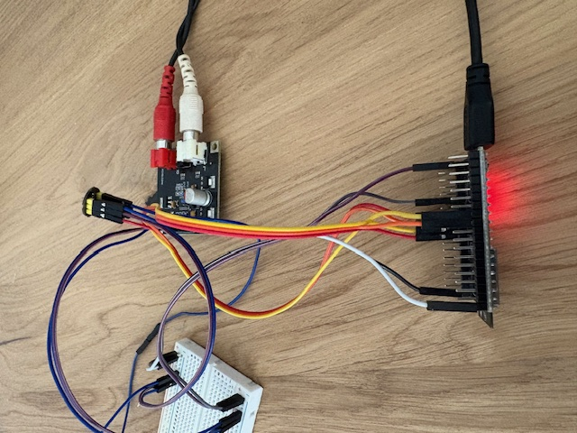

# a2dpSinkHfpClient

**ESP-IDF Component for Bluetooth Classic Audio & Hands-Free**

[](https://github.com/espressif/esp-idf)
[](LICENSE)

Turn your ESP32 into a complete Bluetooth audio device with music streaming and phone call capabilities.

## Features

### 🎵 Audio Streaming (A2DP)
- High-quality Bluetooth audio sink
- Automatic connection handling
- I2S output to external DAC

### 📞 Phone Calls (HFP)
- **Call Control**: Answer, reject, hang up calls
- **Dialing**: Direct dial, redial, speed dial
- **Voice Recognition**: Trigger Siri/Google Assistant
- **Volume Control**: Adjust speaker and microphone volume
- **Phone Queries**: Get operator, call list, own number
- **Advanced Features**: BTRH, XAPL, iPhone battery reporting

### 🎛️ Music Control (AVRC)
- Play/pause control
- Track navigation (next/previous)
- Track metadata (title, artist, album)
- Playback status notifications

### 📇 Contact Sync (PBAP)
- Automatic phonebook download
- Contact storage to SPIFFS
- Country code support for formatting

## Supported Hardware

- **ESP32** (all variants)

### Example Hardware

<table>
<tr>
<td><br/><b>INMP441 Microphone</b></td>
<td><br/><b>PCM5102 DAC</b></td>
<td><br/><b>Complete Setup</b></td>
</tr>
</table>

## Quick Start

### Installation

#### Option 1: ESP Component Registry (Recommended)
```bash
idf.py add-dependency "walinsky/a2dpsinkhfpclient^0.1.0"
```

#### Option 2: Manual
```bash
cd your_project/components
git clone https://github.com/walinsky/a2dpSinkHfpClient.git
```

### Basic Example

```c
#include "a2dpSinkHfpHf.h"
#include "nvs_flash.h"

void app_main(void) {
    nvs_flash_init();

    a2dpSinkHfpHf_config_t config = {
        .device_name = "ESP32-Speaker",
        .i2s_tx_bck = 26,    // Speaker pins
        .i2s_tx_ws = 25,
        .i2s_tx_dout = 22,
        .i2s_rx_bck = 32,    // Microphone pins (for calls)
        .i2s_rx_ws = 33,
        .i2s_rx_din = 34
    };

    a2dpSinkHfpHf_init(&config);
}
```

### HFP Call Control Example

```c
// Answer incoming call
a2dpSinkHfpHf_answer_call();

// Dial a number
a2dpSinkHfpHf_dial_number("5551234567");

// Start voice assistant
a2dpSinkHfpHf_start_voice_recognition();

// Set speaker volume (0-15)
a2dpSinkHfpHf_volume_update("spk", 12);
```

### Music Control Example

```c
// Play/pause
a2dpSinkHfpHf_avrc_play();
a2dpSinkHfpHf_avrc_pause();

// Track navigation
a2dpSinkHfpHf_avrc_next();
a2dpSinkHfpHf_avrc_prev();

// Get metadata
const bt_avrc_metadata_t *meta = a2dpSinkHfpHf_get_avrc_metadata();
if (meta && meta->valid) {
    printf("Now Playing: %s - %s\n", meta->artist, meta->title);
}
```

## Hardware Setup

### Speaker Output (Required)
```
ESP32 Pin → DAC (e.g., PCM5102)
GPIO 26   → BCK
GPIO 25   → LCK (WS)
GPIO 22   → DIN
```

### Microphone Input (Optional - for phone calls)
```
ESP32 Pin → Microphone (e.g., INMP441)
GPIO 32   → SCK
GPIO 33   → WS
GPIO 34   → SD
```

## API Overview

### Initialization
```c
esp_err_t a2dpSinkHfpHf_init(const a2dpSinkHfpHf_config_t *config);
esp_err_t a2dpSinkHfpHf_deinit(void);
```

### HFP Call Control
```c
esp_err_t a2dpSinkHfpHf_answer_call(void);
esp_err_t a2dpSinkHfpHf_reject_call(void);
esp_err_t a2dpSinkHfpHf_hangup_call(void);
esp_err_t a2dpSinkHfpHf_dial_number(const char *number);
esp_err_t a2dpSinkHfpHf_redial(void);
esp_err_t a2dpSinkHfpHf_dial_memory(int location);
```

### Voice Recognition
```c
esp_err_t a2dpSinkHfpHf_start_voice_recognition(void);
esp_err_t a2dpSinkHfpHf_stop_voice_recognition(void);
```

### Volume Control
```c
esp_err_t a2dpSinkHfpHf_volume_update(const char *target, int volume);
// target: "spk" or "mic", volume: 0-15
```

### Phone Queries
```c
esp_err_t a2dpSinkHfpHf_query_operator(void);
esp_err_t a2dpSinkHfpHf_query_current_calls(void);
esp_err_t a2dpSinkHfpHf_retrieve_subscriber_info(void);
```

### AVRC Control
```c
bool a2dpSinkHfpHf_avrc_play(void);
bool a2dpSinkHfpHf_avrc_pause(void);
bool a2dpSinkHfpHf_avrc_next(void);
bool a2dpSinkHfpHf_avrc_prev(void);
```

### Status
```c
bool a2dpSinkHfpHf_is_connected(void);
bool a2dpSinkHfpHf_is_avrc_connected(void);
const bt_avrc_metadata_t* a2dpSinkHfpHf_get_avrc_metadata(void);
```

## Configuration

### ESP-IDF menuconfig

Enable required Bluetooth features:
```
Component config → Bluetooth → Bluedroid Options
    [*] A2DP
    [*] Hands Free Profile
        [*] Audio (SCO) data path in controller → HCI
        [*] Use external codec for mSBC
    [*] Phone Book Access Profile
    [*] AVRCP
```

### Custom PIN Code

```c
// Set PIN before initialization
a2dpSinkHfpHf_set_pin("1234", 4);
a2dpSinkHfpHf_init(&config);
```

### Phonebook Sync

1. Add SPIFFS partition to `partitions.csv`:
```csv
# Name,   Type, SubType, Offset,  Size
nvs,      data, nvs,     0x9000,  0x6000
phy_init, data, phy,     0xf000,  0x1000
factory,  app,  factory, 0x10000, 1536K
storage,  data, spiffs,  ,        1M
```

2. Set country code:
```c
a2dpSinkHfpHf_set_country_code("1");  // USA
```

## Examples

See the `examples/` directory for complete examples:
- **minimal** - just a minimal setup; that plays audio and lets you make phone calls
- **hfp** - Interactive command-line interface for testing all HFP and avrc features
- **avrc** - AVRC control with metadata display

After you have downloaded the component, `cd` into the component/examples/[your choice]
folder, (optionally edit the COMPILE-TIME CONFIGURATION in `main/main.c`) and just `idf.py build flash monitor`.

## Documentation

Complete documentation available in the Wiki:
- [Getting Started](https://github.com/walinsky/a2dpSinkHfpClient/wiki/Getting-Started)
- [API Reference](https://github.com/walinsky/a2dpSinkHfpClient/wiki/API-Reference)
- [HFP Control Guide](https://github.com/walinsky/a2dpSinkHfpClient/wiki/HFP-Control)
- [Examples](https://github.com/walinsky/a2dpSinkHfpClient/wiki/Examples)
- [Configuration](https://github.com/walinsky/a2dpSinkHfpClient/wiki/Configuration)
- [Troubleshooting](https://github.com/walinsky/a2dpSinkHfpClient/wiki/Troubleshooting)

## Requirements

- **ESP-IDF**: v5.0 or later (v5.5.1 recommended)
- **External DAC**: PCM5102, MAX98357A, or similar I2S DAC
- **Microphone**: INMP441 or similar I2S microphone (optional, for calls)

## Pin Configuration

You can use any available GPIO pins. The examples use:

| Function    | Default Pin | Configurable |
|-------------|-------------|--------------|
| Speaker BCK | GPIO 26     | ✓            |
| Speaker WS  | GPIO 25     | ✓            |
| Speaker DOUT| GPIO 22     | ✓            |
| Mic BCK     | GPIO 32     | ✓            |
| Mic WS      | GPIO 33     | ✓            |
| Mic DIN     | GPIO 34     | ✓            |

## License

MIT License - see [LICENSE](LICENSE) file for details.

## Contributing

Contributions are welcome! Please:
1. Fork the repository
2. Create a feature branch
3. Make your changes
4. Submit a pull request

## Author

walinsky

## Acknowledgments

Based on ESP-IDF Bluetooth examples and inspired by the ESP32 community.

## Support

- Report issues: [GitHub Issues](https://github.com/walinsky/a2dpSinkHfpClient/issues)
- Discussions: [GitHub Discussions](https://github.com/walinsky/a2dpSinkHfpClient/discussions)
- Wiki: [Documentation](https://github.com/walinsky/a2dpSinkHfpClient/wiki)
